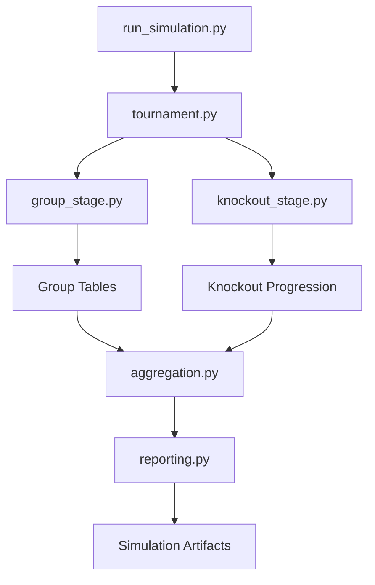

# ⚽ World Cup 2026 Forecasting Engine

A production-style football forecasting system that combines machine learning match prediction with Monte Carlo tournament simulation to estimate advancement and championship probabilities for international tournaments.

This project demonstrates an end-to-end **sports analytics pipeline**, including:

- feature engineering from historical match data
- probabilistic match outcome modeling
- tournament simulation engine
- large-scale Monte Carlo forecasting
- analytics reporting and visualization
- interactive dashboard

The system is inspired by forecasting methodologies used by organizations such as **FiveThirtyEight, Opta, and sports betting analytics teams**.

---

# 🧠 Project Objective

Estimate the probability that each national team:

- advances from the group stage
- reaches the quarterfinals
- reaches the semifinals
- reaches the final
- wins the tournament

This is achieved by simulating thousands of full tournaments using a trained match outcome model.

---

# 🏗 System Architecture

The forecasting pipeline follows a modular architecture:

historical match data
        ↓
feature engineering pipeline
        ↓
ML match outcome model
        ↓
predict_match(team_a, team_b)
        ↓
Monte Carlo tournament simulation
        ↓
N simulated tournaments
        ↓
probability aggregation
        ↓
forecast outputs

The system separates **modeling, simulation, and reporting** components to maintain a clean and extensible architecture.

---

# 🧩 Forecasting System Architecture

The project is organized as a modular forecasting pipeline combining data engineering, machine learning, and simulation components.

```mermaid
flowchart TD

A[Historical Match Data] --> B[Data Ingestion]
B --> C[Feature Engineering]

C --> D[Team Strength Features]
D --> E[Match Outcome Model]

E --> F[predict_match(team_a, team_b)]

F --> G[Monte Carlo Tournament Simulation]

G --> H[Group Stage Simulation]
H --> I[Knockout Stage Simulation]

I --> J[Tournament Results]

J --> K[Aggregation Layer]

K --> L[Team Advancement Probabilities]
K --> M[Champion Distribution]
K --> N[Match Logs]

L --> O[Simulation Artifacts]
M --> O
N --> O

O --> P[Streamlit Dashboard]
```

The architecture follows a production-style separation between data processing,
predictive modeling, simulation, and reporting layers.

## Component Responsabilities

| Component               | Responsibility                                            |
| ----------------------- | --------------------------------------------------------- |
| **Data ingestion**      | Load historical international match results               |
| **Feature engineering** | Build Elo and rolling performance features                |
| **Match outcome model** | Predict win/draw/loss probabilities                       |
| **Simulation engine**   | Simulate tournaments using probabilistic match outcomes   |
| **Aggregation layer**   | Convert simulation results into advancement probabilities |
| **Reporting layer**     | Export artifacts and power dashboard visualizations       |
| **Dashboard**           | Interactive exploration of forecast results               |

---

## Simulation Engine Internals

The tournament simulation engine is composed of several modules:



---

Key outputs include:

- team advancement probabilities

- champion probability distribution

- simulated match logs

- simulation metadata

---

# 📊 Data Pipeline

The system uses historical international match data to construct team strength features.

## Input Data

Historical international matches including:

- match results
- teams
- match dates
- tournaments
- goals scored

## Feature Engineering

For each national team the pipeline builds rolling metrics such as:

- Elo rating
- rolling goals scored
- rolling goals conceded
- rolling goal difference
- rolling win rate
- rolling points

These features represent **current team strength** and are stored in:

`data/processed/latest_team_features.parquet`

This snapshot is used as the starting point for tournament simulation.

---

# 🤖 Match Outcome Model

The match prediction model estimates:

P(win)  
P(draw)  
P(loss)

from the perspective of **team A**.

## Baseline Model

Current implementation:

**Multiclass Logistic Regression**

## Input Features

Examples of model inputs include:

- Elo difference
- rolling performance metrics
- recent goal differential
- win rate indicators

The model outputs **probability distributions** that feed directly into the simulation engine.

---

# 🎲 Tournament Simulation Engine

The tournament simulator transforms match probabilities into full tournament forecasts.

Core logic:

predict_match(team_a, team_b)  
        ↓  
probability distribution  
        ↓  
sample match outcome  
        ↓  
simulate tournament  
        ↓  
repeat N times  

Each simulation generates:

- group standings
- qualified teams
- knockout progression
- finalists
- champion

---

# 🏆 Monte Carlo Forecasting

The engine runs thousands of simulated tournaments.

Typical runs:

10,000 – 100,000 tournament simulations

Simulation outputs are aggregated into probabilities.

Example forecast output:

| Team | Group Adv | QF | SF | Final | Champion |
|-----|-----|-----|-----|-----|-----|
| Spain | 89% | 43% | 33% | 21% | 11% |
| Argentina | 88% | 41% | 31% | 20% | 10% |
| France | 83% | 37% | 25% | 16% | 8% |

---

# 📁 Project Structure

```bash
world-cup-2026-forecast
│
├── app
│   └── streamlit_app.py
│
├── configs
│   ├── allowed_teams.yaml
│   ├── data.yaml
│   ├── model_match.yaml
│   ├── model_player.yaml
│   ├── model_team.yaml
│   ├── simulation.yaml
│   └── world_cup_groups.json
│
├── data
│   ├── raw
│   ├── external
│   ├── interim
│   ├── processed
│   └── outputs
│
├── docs
│   ├── dashboard_guide.md
│   ├── data_dictionary.md
│   ├── engineering_notes.md
│   ├── methodology.md
│   └── modeling_notes.md
│
├── notebooks
│   ├── README.md
│   ├── 00_eda_match_dataset.ipynb
│   ├── 01_match_model_experiments.ipynb
│   ├── 02_simulation_analysis.ipynb
│   └── 03_world_cup_forecast_story.ipynb
│
├── src
│   ├── dashboard
│   ├── evaluation
│   ├── features
│   ├── ingestion
│   ├── models
│   ├── pipelines
│   ├── simulation
│   └── utils
│
├── tests
│
├── pyproject.toml
├── requirements.txt
└── README.md
```

---

# ▶ Running the Simulation

Run tournament simulations from the command line:

py -m src.simulation.run_simulation --groups-path configs/world_cup_groups.json --num-simulations 10000

Example output:

TOP TEAMS BY CHAMPION PROBABILITY

Spain        22.5%  
Argentina    21.0%  
Colombia      9.4%  
France        6.9%  
England       6.8%  

Simulation artifacts are exported to:

`data/outputs/simulation`

Example outputs:

- team_probabilities.csv  
- champion_distribution.csv  
- match_logs.parquet  
- summary_metadata.json  

---

# 📈 Dashboard

A Streamlit dashboard allows interactive exploration of forecast results.

Run:

streamlit run app/streamlit_app.py

The dashboard provides:

- champion probability rankings
- advancement probability tables
- team comparison tools
- simulation result exploration

---

# 📓 Research Notebooks

The project includes research notebooks used during development.

These notebooks are **not required to run the production simulation pipeline**.

| Notebook | Purpose |
|--------|--------|
| 00_eda_match_dataset.ipynb | Exploratory data analysis of the match dataset |
| 01_match_model_experiments.ipynb | Model experimentation and validation |
| 02_simulation_analysis.ipynb | Analysis of Monte Carlo simulation outputs |
| 03_world_cup_forecast_story.ipynb | Forecast storytelling and portfolio presentation |

---

# ⚠ Current Limitations

This version intentionally simplifies several aspects of real tournaments.

### No explicit goal model

Matches simulate win/draw/loss outcomes only.

Future improvement: **Poisson goal model**

### Simplified knockout tie resolution

Draws in knockout rounds are resolved using simplified rules rather than modeling extra time.

### Simplified tournament format

Current implementation uses a **32-team format**:

8 groups × 4 teams

Future versions will support the **48-team World Cup 2026 format**.

---

# 🚀 Future Improvements

Potential extensions include:

- Poisson goal scoring models
- expected goals (xG) features
- player-level strength models
- full 2026 tournament format (48 teams)
- scenario simulations (injuries, squad changes)
- distributed simulation engine

---

# 🎯 Why This Project

This project demonstrates the ability to build **end-to-end sports analytics systems**, including:

- feature engineering pipelines
- probabilistic modeling
- simulation architecture
- large-scale forecasting
- analytics dashboards

These techniques are directly applicable to:

- football club analytics departments
- sports data companies
- betting analytics teams
- performance analysis groups

---

# 👤 Author

Manuel Pérez Bañuls  
Data Scientist focused on **football analytics, predictive modeling, and performance analysis**.

---

# 📜 License

MIT License
