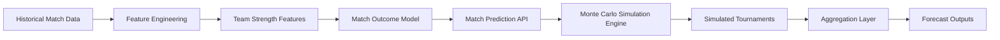
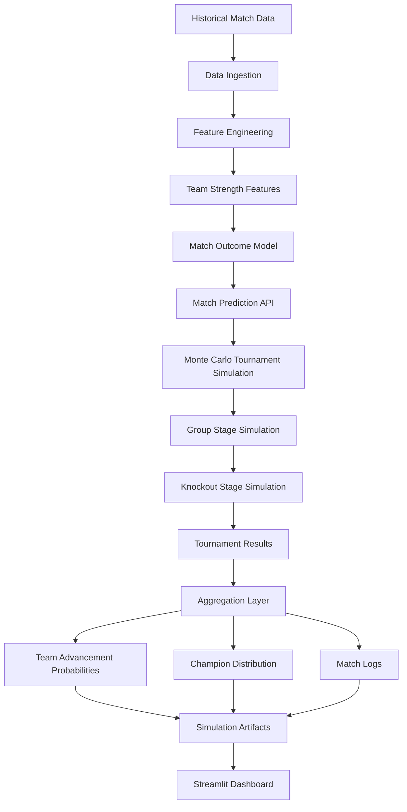
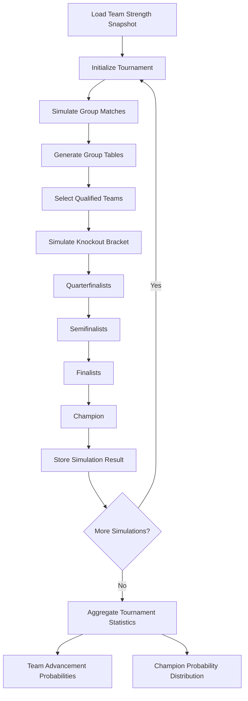

# ⚽ World Cup 2026 Forecasting Engine

[](https://www.python.org/)
[](https://opensource.org/licenses/MIT)
[]()

A production-style football forecasting system that combines **machine
learning match prediction** with **Monte Carlo tournament simulation**
to estimate advancement and championship probabilities for international
tournaments.

This project demonstrates a full **sports analytics forecasting
pipeline**, including:

-   feature engineering from historical match data
-   probabilistic match outcome modeling
-   tournament simulation engine
-   large-scale Monte Carlo forecasting
-   analytics reporting and visualization
-   interactive dashboard

The system is inspired by forecasting methodologies used by
organizations such as **FiveThirtyEight, Opta, and sports betting
analytics teams**.

## ⭐ Key Features

- End-to-end sports forecasting pipeline
- Modular tournament simulation engine
- Probabilistic match outcome modeling
- Large-scale Monte Carlo forecasting (10k–100k simulations)
- Reproducible simulation artifacts
- Interactive Streamlit dashboard
- Research and experimentation environment

## 📋 Table of Contents

- [🧠 Project Objective](#-project-objective)
- [🏗 System Architecture](#-system-architecture)
- [🧩 Forecasting System Architecture](#-forecasting-system-architecture)
- [⚙ Tournament Simulation Flow](#-tournament-simulation-flow)
- [🧠 Component Responsibilities](#-component-responsibilities)
- [⚙ Simulation Engine Internals](#-simulation-engine-internals)
- [📊 Data Pipeline](#-data-pipeline)
- [🤖 Match Outcome Model](#-match-outcome-model)
- [🎲 Tournament Simulation Engine](#-tournament-simulation-engine)
- [🏆 Monte Carlo Forecasting](#-monte-carlo-forecasting)
- [📁 Project Structure](#-project-structure)
- [▶ Running the Simulation](#-running-the-simulation)
- [📦 Simulation Outputs](#-simulation-outputs)
- [📈 Dashboard](#-dashboard)
- [� Docs & Reproducibility](#-docs--reproducibility)
- [⚠ Current Limitations](#-current-limitations)
- [🚀 Future Improvements](#-future-improvements)
- [🎯 Why This Project](#-why-this-project)
- [👤 Author](#-author)
- [📜 License](#-license)

---

## 🚀 Quick Start

1. **Clone the repository**
   ```bash
   git clone https://github.com/yourusername/world-cup-2026-forecast.git
   cd world-cup-2026-forecast
   ```

2. **Set up environment**
   ```bash
   python -m venv venv
   source venv/bin/activate  # On Windows: venv\Scripts\activate
   pip install -r requirements.txt
   ```

3. **Run a simulation**
   ```bash
   python -m src.simulation.run_simulation --num-simulations 1000
   ```

4. **Launch dashboard**
   ```bash
   streamlit run app/streamlit_app.py
   ```

---

## 🧠 Project Objective

Estimate the probability that each national team:

-   advances from the group stage
-   reaches the Round of 16
-   reaches the quarterfinals
-   reaches the semifinals
-   reaches the final
-   wins the tournament

This is achieved by **simulating thousands of complete tournaments**
using a trained match outcome model.

---

## 🎥 Demo & Screenshots

Figures are generated from the analysis notebooks and exported automatically
to `docs/images` to keep documentation synchronized with simulation outputs.

### Champion Probability Forecast

Forecasted probability of winning the FIFA World Cup 2026 based on Monte Carlo simulation results.


---

### Team Progression Probabilities

Probability of each team reaching different stages of the tournament.


---

### Champion Distribution

Distribution of simulated tournament champions across all Monte Carlo runs.


---

Results shown are produced from **large-scale tournament simulations (10,000–100,000 runs)** using the match prediction model and simulation engine.

---

## 🏗 System Architecture

The forecasting pipeline follows a modular architecture:



The system separates **modeling, simulation, and reporting** components
to maintain a clean and extensible architecture.

---

## 🧩 Forecasting System Architecture

The project is organized as a modular forecasting pipeline combining
**data engineering, machine learning, and simulation components**.


The architecture follows a **production-style separation between data
processing, predictive modeling, simulation, and reporting layers**.

---

## ⚙ Tournament Simulation Flow


---

## 🧠 Component Responsibilities

| Component | Responsibility |
|---|---|
| Data ingestion | Load historical international match results |
| Feature engineering | Build Elo and rolling performance features |
| Match outcome model | Predict win/draw/loss probabilities |
| Simulation engine | Simulate tournaments using probabilistic match outcomes |
| Aggregation layer | Convert simulation results into advancement probabilities |
| Reporting layer | Export artifacts and power dashboard visualizations |
| Dashboard | Interactive exploration of forecast results |

---

## ⚙ Simulation Engine Internals

The tournament simulation engine is composed of several modules:

    run_simulation.py
            ↓
    tournament.py
            ↓
    group_stage.py
    knockout_stage.py
            ↓
    aggregation.py
            ↓
    reporting outputs

Key outputs include:

-   team advancement probabilities
-   champion probability distribution
-   simulated match logs
-   simulation metadata

## Core Simulation Components

| Module | Description |
|------|-------------|
| `run_simulation.py` | Entry point for running tournament simulations |
| `group_stage.py` | Group stage match simulation and standings |
| `knockout_stage.py` | Knockout bracket simulation |
| `aggregation.py` | Aggregation of Monte Carlo results |
| `reporting.py` | Export of simulation artifacts |

---

## 📊 Data Pipeline

The system uses historical international football match data to
construct **team strength features**.

## Input Data

Historical international matches including:

-   match results
-   teams
-   match dates
-   tournaments
-   goals scored

## Feature Engineering

For each national team the pipeline builds rolling metrics such as:

-   Elo rating
-   rolling goals scored
-   rolling goals conceded
-   rolling goal difference
-   rolling win rate
-   rolling points

These features represent current team strength and are stored in:

    data/processed/latest_team_features.parquet

This snapshot is used as the starting point for tournament simulation.

---

## 🤖 Match Outcome Model

The match prediction model estimates:

    P(win)
    P(draw)
    P(loss)

from the perspective of **team A**.

## Baseline Model

Current implementation:

**Multiclass Logistic Regression**

## Input Features

Examples include:

-   Elo difference
-   rolling performance metrics
-   recent goal differential
-   win rate indicators

The model outputs probability distributions that feed directly into the
simulation engine.

---

## 🎲 Tournament Simulation Engine

The tournament simulator transforms match probabilities into full
tournament forecasts.

Core logic:

    predict_match(team_a, team_b)
            ↓
    probability distribution
            ↓
    sample match outcome
            ↓
    simulate tournament
            ↓
    repeat N times

Each simulation generates:

-   group standings
-   qualified teams
-   knockout progression
-   finalists
-   champion

---

## 🏆 Monte Carlo Forecasting

The engine runs thousands of simulated tournaments.

Typical runs:

    10,000 – 100,000 simulations

Simulation outputs are aggregated into probabilities.

### Example Forecast Output

| Team | Advance from Group | Round of 16 | Quarterfinal | Semifinal | Final | Champion |
|---|---:|---:|---:|---:|---:|---:|
| Spain | 88.8% | 57.7% | 43.0% | 33.4% | 23.1% | 23.1% |
| Argentina | 88.5% | 56.8% | 41.2% | 30.7% | 20.8% | 20.8% |
| France | 85.2% | 52.3% | 37.5% | 26.9% | 15.6% | 9.4% |


These probabilities are produced by aggregating thousands of simulated
tournaments.

---

## 📁 Project Structure

```bash
world-cup-2026-forecast
│
├── app/                        # Streamlit dashboard for forecast visualization
│
├── configs/                    # Simulation configuration files
│
├── data/
│   ├── external/               # External raw datasets
│   ├── raw/                    # Raw match datasets
│   ├── interim/                # Intermediate processed datasets
│   ├── processed/              # Clean modeling datasets
│   └── outputs/
│       └── simulation/         # Simulation outputs (team probabilities, match logs, etc.)
│
├── docs/                       # Technical documentation
│   ├── architecture.md
│   ├── engineering.md
│   ├── modeling.md
│   ├── project_status.md
│   └── images/                 # Visual assets used in README and documentation
│
├── experiments/                # Research and model experimentation notebooks
│   └── 01_match_model_experiments.ipynb
│
├── notebooks/                  # Analytical and storytelling notebooks
│   ├── 00_eda_match_dataset.ipynb
│   ├── 02_simulation_analysis.ipynb
│   ├── 03_world_cup_forecast_story.ipynb
│   └── README.md
│
├── src/                        # Production forecasting pipeline
│   ├── models/                 # Match outcome prediction models
│   ├── simulation/             # Tournament simulation engine
│   └── utils/                  # Utility modules
│
├── tests/                      # Unit tests
│
├── .env.example                # Environment configuration template
├── pyproject.toml              # Project configuration
├── requirements.txt            # Python dependencies
└── README.md                   # Project overview
```

---

## ▶ Running the Simulation

### Classic Tournament (32 teams)

``` bash
py -m src.simulation.run_simulation \
  --groups-path configs/world_cup_groups.json \
  --num-simulations 10000
```

### World Cup 2026 (48 teams)

``` bash
py -m src.simulation.run_simulation \
  --groups-path configs/world_cup_groups_48.json \
  --bracket-config-path configs/world_cup_2026_bracket.json \
  --num-simulations 10000 \
  --simulation-format v2
```

### Parameters

| Parameter | Description |
|---|---|
| `--groups-path` | JSON group stage configuration |
| `--bracket-config-path` | Knockout bracket configuration |
| `--num-simulations` | Number of Monte Carlo tournament simulations |
| `--simulation-format` | `v1` (32 teams) or `v2` (48 teams) |


## 📦 Simulation Outputs

Simulation artifacts are exported to:

    data/outputs/simulation

Generated files:

-   team_probabilities.csv
-   champion_distribution.csv
-   match_logs.parquet
-   summary_metadata.json

Example (team_probabilities.csv):

| team | advance_from_group_prob | semifinal_prob | champion_prob |
|-----|-----|-----|-----|
| Spain | 0.888 | 0.430 | 0.231 |
| Argentina | 0.885 | 0.412 | 0.208 |

These artifacts are later consumed by the **Streamlit dashboard**.

---

## � Docs & Reproducibility

### 📚 Technical Documentation

Detailed technical documentation is available in the `docs/` directory:

- Architecture overview → `docs/architecture.md`
- Engineering decisions → `docs/engineering.md`
- Modeling approach → `docs/modeling.md`
- Project roadmap → `docs/project_status.md`

---

### 🔁 Reproducibility

All simulation artifacts can be reproduced by running the simulation engine
with the provided configuration files.

Notebooks in `notebooks/` and `experiments/` allow exploration and validation
of the modeling and simulation pipeline.

---

### 📓 Research and Analytical Notebooks

The repository includes several notebooks used during the development and analysis of the forecasting framework.

These notebooks are intended for **exploration, validation, and communication of results** and are not part of the production pipeline.

#### Research Experiments

Research-oriented experiments are stored in the `experiments/` directory.

| Notebook | Purpose |
|--------|--------|
| `01_match_model_experiments.ipynb` | Exploratory experimentation with match outcome models and feature configurations |

These notebooks were used to test modeling ideas before integrating finalized approaches into the production codebase.

---

#### Analytical Notebooks

The `notebooks/` directory contains analysis and storytelling notebooks built on top of the production simulation pipeline.

| Notebook | Purpose |
|--------|--------|
| `00_eda_match_dataset.ipynb` | Exploratory analysis of the historical football match dataset |
| `02_simulation_analysis.ipynb` | Analysis of Monte Carlo simulation outputs and team progression probabilities |
| `03_world_cup_forecast_story.ipynb` | Narrative forecast of the FIFA World Cup 2026 highlighting contenders and tournament uncertainty |

These notebooks help interpret the model outputs and provide transparency into how tournament forecasts are generated.

---

## 📈 Dashboard

A Streamlit dashboard allows interactive exploration of forecast
results.

Run:

``` bash
streamlit run app/streamlit_app.py
```

The dashboard provides:

-   champion probability rankings
-   advancement probability tables
-   team explorer
-   probability charts
-   simulation match logs

----

## 📓 Research and Analytical Notebooks

The repository includes several notebooks used during the development and analysis of the forecasting framework.

These notebooks are intended for **exploration, validation, and communication of results** and are not part of the production pipeline.

## Research Experiments

Research-oriented experiments are stored in the `experiments/` directory.

| Notebook | Purpose |
|--------|--------|
| `01_match_model_experiments.ipynb` | Exploratory experimentation with match outcome models and feature configurations |

These notebooks were used to test modeling ideas before integrating finalized approaches into the production codebase.

---

## Analytical Notebooks

The `notebooks/` directory contains analysis and storytelling notebooks built on top of the production simulation pipeline.

| Notebook | Purpose |
|--------|--------|
| `00_eda_match_dataset.ipynb` | Exploratory analysis of the historical football match dataset |
| `02_simulation_analysis.ipynb` | Analysis of Monte Carlo simulation outputs and team progression probabilities |
| `03_world_cup_forecast_story.ipynb` | Narrative forecast of the FIFA World Cup 2026 highlighting contenders and tournament uncertainty |

These notebooks help interpret the model outputs and provide transparency into how tournament forecasts are generated.

---

## Relationship to the Production Pipeline

The repository separates **research, analysis, and production code**:

| Directory | Purpose |
|----------|--------|
| `experiments/` | Research and model experimentation |
| `notebooks/` | Analytical and storytelling notebooks |
| `src/` | Production forecasting and simulation pipeline |

This separation ensures that the production system remains stable while allowing ongoing experimentation and analysis.

---

## ⚠ Current Limitations

This version simplifies several aspects of real tournaments.

### No explicit goal model

Matches simulate win/draw/loss outcomes only.

Future improvement: **Poisson goal model**

### Simplified knockout tie resolution

Draws in knockout rounds are resolved using simplified rules rather than
modeling extra time.

---

## Environment setup

Create a local environment configuration file:

```bash
cp .env.example .env
```
Edit the variables if necessary.

The .env file is ignored by git and should not be committed to the repository.

---

## 🚀 Future Improvements

Potential extensions include:

-   Poisson goal scoring models
-   expected goals (xG) features
-   player-level strength models
-   scenario simulations (injuries, squad changes)
-   distributed simulation engine

---

## 🎯 Why This Project

This project was designed as a **production-style sports analytics system**
that mirrors how forecasting pipelines are implemented in professional
analytics teams.

This project demonstrates the ability to build **end-to-end sports
analytics systems**, including:

-   feature engineering pipelines
-   probabilistic modeling
-   simulation architecture
-   large-scale forecasting
-   analytics dashboards

These techniques are directly applicable to:

-   football club analytics departments
-   sports data companies
-   betting analytics teams
-   performance analysis groups

## Skills Demonstrated

| Area | What the project shows |
|---|---|
| Data Engineering | Structured ingestion, feature pipelines, reproducible outputs |
| Machine Learning | Probabilistic classification for football match outcomes |
| Simulation | Monte Carlo tournament engine with configurable formats |
| Analytics Engineering | Aggregation layers, artifact exports, forecast tables |
| Product Thinking | Interactive Streamlit dashboard for stakeholder exploration |
| Sports Analytics | Football-specific modeling, tournament logic, forecasting use cases |

---

## 👤 Author

Manuel Pérez Bañuls\
Data Scientist focused on **football analytics, predictive modeling, and
performance analysis**.

---

## 📜 License

MIT License
