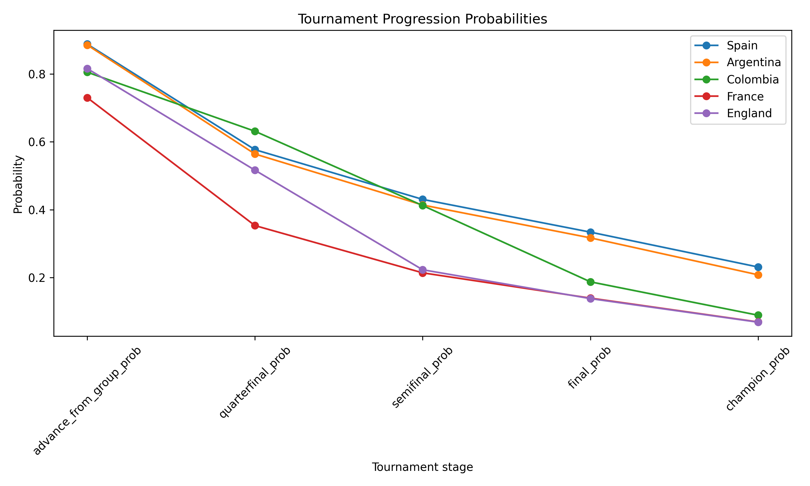
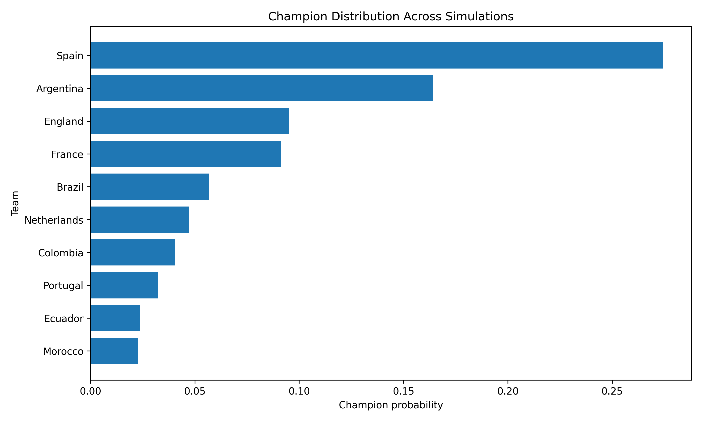
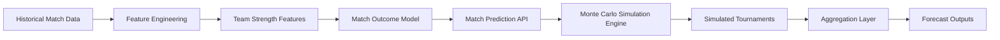
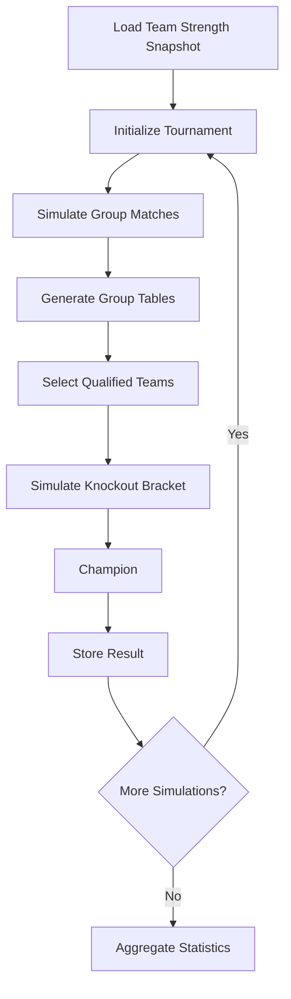
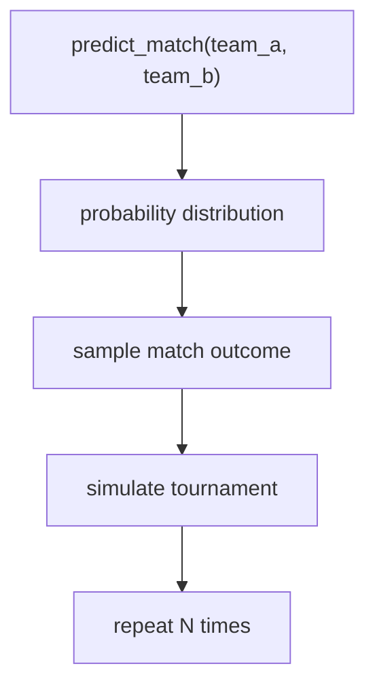

# ⚽ World Cup 2026 Forecasting Engine

## Probabilistic Tournament Simulation with Machine Learning

[](https://www.python.org/)
[](https://opensource.org/licenses/MIT)
[]()

A **production-style football forecasting system** combining **machine
learning match prediction** with **Monte Carlo tournament simulation**
to estimate advancement and championship probabilities for international
tournaments.

Inspired by forecasting methodologies used by **FiveThirtyEight, Opta,
and professional sports analytics teams**.

---

# 📊 Executive Summary

This project builds a **probabilistic forecasting engine for
international football tournaments**.

| Metric | Value |
|--------|-------|
| Historical matches | ~31,000 |
| Model | Multiclass Logistic Regression |
| Simulation scale | 10,000 – 100,000 tournaments |
| Tournament formats | 32 teams / 48 teams |
| Outputs | Advancement & champion probabilities |
| Interface | Interactive Streamlit dashboard |

The system simulates **thousands of full tournaments** to estimate
probability distributions rather than deterministic predictions.

---

# 🏆 Key Results & Performance

| Metric | Value |
|--------|-------|
| **Model Accuracy** | Baseline logistic regression on historical data |
| **Dataset Size** | ~31,000 international matches (1994–2024) |
| **Probability Calibration** | Temporal train/test split methodology |
| **Simulation Scale** | 10,000–100,000 Monte Carlo tournaments |
| **Forecast Granularity** | Stage-by-stage progression probabilities |
| **Example Output** | Spain: 88.8% group advance, 23.1% champion |
| **Production Ready** | End-to-end pipeline, modular architecture, artifacts export |

---

# ⭐ Key Features

| Feature | Description |
|---------|-------------|
| End-to-end pipeline | Data → modeling → simulation → reporting |
| Match prediction model | Probabilistic win/draw/loss predictions |
| Monte Carlo simulation | Large-scale tournament simulation |
| Modular architecture | Separate modeling, simulation, reporting |
| Reproducible outputs | Structured simulation artifacts |
| Interactive dashboard | Explore forecast probabilities |
| Research environment | Notebooks for experimentation & analysis |

---

# 🛠 Tech Stack

| Component | Technology |
|-----------|-----------|
| **Language** | Python 3.8+ |
| **Data Processing** | pandas, numpy, scipy |
| **Machine Learning** | scikit-learn (Logistic Regression) |
| **Simulation Engine** | Custom probabilistic Monte Carlo |
| **Data Formats** | Parquet, CSV, JSON |
| **Visualization** | Streamlit, matplotlib/plotly |
| **Configuration** | YAML (configs/) |
| **Versioning** | joblib (model persistence) |

---

# 📋 Table of Contents

-   [🏆 Key Results & Performance](#-key-results--performance)
-   [🛠 Tech Stack](#-tech-stack)
-   [🚀 Quick Start](#-quick-start)
-   [🧠 Project Objective](#-project-objective)
-   [🎥 Demo & Screenshots](#-demo--screenshots)
-   [🏗 System Architecture](#-system-architecture)
-   [⚙ Tournament Simulation Flow](#-tournament-simulation-flow)
-   [🧠 Component Responsibilities](#-component-responsibilities)
-   [📊 Data Pipeline](#-data-pipeline)
-   [🤖 Match Outcome Model](#-match-outcome-model)
-   [📈 Model Evaluation & Validation](#-model-evaluation--validation)
-   [🎲 Tournament Simulation Engine](#-tournament-simulation-engine)
-   [🏆 Monte Carlo Forecasting](#-monte-carlo-forecasting)
-   [📊 Example Forecast Output](#-example-forecast-output)
-   [📁 Project Structure](#-project-structure)
-   [▶ Running the Simulation](#-running-the-simulation)
-   [📦 Simulation Outputs](#-simulation-outputs)
-   [📈 Dashboard](#-dashboard)
-   [📚 Docs & Reproducibility](#-docs--reproducibility)
-   [📥 Input/Output Specification](#-inputoutput-specification)
-   [🔗 Notebooks & Analysis](#-notebooks--analysis)
-   [❓ FAQ](#-faq)
-   [⚠ Current Limitations](#-current-limitations)
-   [🎓 For Recruiters & Data Scientists](#-for-recruiters--data-scientists)
-   [🚀 Future Improvements](#-future-improvements)
-   [🎯 Why This Project](#-why-this-project)
-   [👤 Author](#-author)
-   [📜 License](#-license)

---

# 🚀 Quick Start

## Clone the repository

``` bash
git clone https://github.com/yourusername/world-cup-2026-forecast.git
cd world-cup-2026-forecast
```

## Create environment

``` bash
python -m venv venv
source venv/bin/activate
pip install -r requirements.txt
```

## Run a simulation

``` bash
python -m src.simulation.run_simulation --num-simulations 1000
```

## Launch dashboard

``` bash
streamlit run app/streamlit_app.py
```

---

# 🧠 Project Objective

Estimate the probability that each national team:

| Stage |
|-------|
| Advances from the group stage |
| Reaches Round of 16 |
| Reaches Quarterfinals |
| Reaches Semifinals |
| Reaches Final |
| Wins the tournament |

This is achieved by **simulating thousands of full tournaments** using a
trained match prediction model.

---

# 🎥 Demo & Screenshots

Figures generated from simulation analysis notebooks.

## Champion Probability Forecast


## Team Progression Probabilities



## Champion Distribution



---

# 🏗 System Architecture



The system separates **data processing, predictive modeling, simulation,
and reporting** layers.

---

# ⚙ Tournament Simulation Flow



---

# 🧠 Component Responsibilities

| Component | Responsibility |
|-----------|----------|
| Data ingestion | Load historical match data |
| Feature engineering | Build team strength features |
| Match outcome model | Predict win/draw/loss probabilities |
| Simulation engine | Simulate tournaments |
| Aggregation layer | Compute advancement probabilities |
| Reporting layer | Export artifacts |
| Dashboard | Interactive exploration of forecasts |

---

# 📊 Data Pipeline

Historical international match data is transformed into **team strength
features**.

Key features include:

| Feature Type | Examples |
|---|---|
| Rating metrics | Elo rating, Elo difference |
| Performance metrics | Rolling goals scored/conceded |
| Form metrics | Rolling win rate |

Stored snapshot:

    data/processed/latest_team_features.parquet

---

# 🤖 Match Outcome Model

The model predicts probabilities for:

| Outcome |
|---------|
| Win |
| Draw |
| Loss |

Baseline model:

**Multiclass Logistic Regression**

Input features include Elo differences and rolling team performance
metrics.

---

# 📈 Model Evaluation & Validation

## Methodology

The model was evaluated using a **temporal train/test split** approach to avoid data leakage and reflect real-world forecasting conditions.

## Evaluation Metrics

| Metric | Purpose |
|--------|---------|
| Log Loss | Quality of probability estimates |
| Accuracy | Correct outcome prediction |
| Brier Score | Calibration of probabilities |

## Model Characteristics

- **Baseline Model**: Multiclass Logistic Regression
- **Training Data**: ~31,000 historical international matches
- **Features**: Elo ratings, rolling performance metrics, goal differential
- **Output**: Probability distributions for win/draw/loss

## Validation Approach

The logistic regression model serves as a **baseline probabilistic predictor** for the simulation engine. Model predictions feed directly into Monte Carlo simulations, making calibration quality critical.

---

# 🎲 Tournament Simulation Engine

Simulation logic:



Each run produces:

-   group standings
-   knockout progression
-   finalists
-   champion

---

# 🏆 Monte Carlo Forecasting

Typical simulations:

    10,000 – 100,000 tournaments

Aggregating thousands of simulations produces **robust probability
estimates**.

---

# 📊 Example Forecast Output

Example probabilities from simulation results:

| Team | Advance Group | Semifinal | Final | Champion |
|------|---|---|---|---|
| Spain | 88.8% | 33.4% | 23.1% | 23.1% |
| Argentina | 88.5% | 30.7% | 20.8% | 20.8% |
| France | 85.2% | 26.9% | 15.6% | 9.4% |

---

# 📁 Project Structure

``` bash
world-cup-2026-forecast
│
├── app/                # Streamlit dashboard
├── configs/            # Tournament configuration files
├── data/               # Datasets and simulation outputs
├── docs/               # Technical documentation
├── experiments/        # Modeling experiments
├── notebooks/          # Analysis notebooks
├── src/                # Forecasting pipeline
└── tests/              # Unit tests
```

---

# ▶ Running the Simulation

## Classic format (32 teams)

``` bash
py -m src.simulation.run_simulation --groups-path configs/world_cup_groups.json --num-simulations 10000
```

## World Cup 2026 format (48 teams)

``` bash
py -m src.simulation.run_simulation --groups-path configs/world_cup_groups_48.json --bracket-config-path configs/world_cup_2026_bracket.json --simulation-format v2 --num-simulations 10000
```

---

# 📦 Simulation Outputs

Generated artifacts:

| File | Description |
|------|-------------|
| team_probabilities.csv | Advancement probabilities |
| champion_distribution.csv | Champion distribution |
| match_logs.parquet | Simulated match logs |
| summary_metadata.json | Simulation metadata |

Saved in:

    data/outputs/simulation

---

# 📈 Dashboard

Interactive dashboard built with **Streamlit**.

Run:

``` bash
streamlit run app/streamlit_app.py
```

Dashboard capabilities:

-   Champion probability rankings
-   Team advancement probabilities
-   Team comparison tools
-   Simulation charts

---

# 📚 Docs & Reproducibility

Detailed documentation available in `docs/`:

| Document | Description |
|---|---|
| architecture.md | System architecture |
| engineering.md | Engineering decisions |
| modeling.md | Modeling methodology |
| project_status.md | Project roadmap |

---

# 📥 Input/Output Specification

## Input Data Format

### Team Strength Features (Required)
```json
{
  "team": "Spain",
  "elo_rating": 2150,
  "rolling_goals_scored": 2.4,
  "rolling_goals_conceded": 1.1,
  "rolling_win_rate": 0.65,
  "rolling_points": 2.0
}
```

**Source**: `data/processed/latest_team_features.parquet`

### Tournament Configuration (YAML)
```yaml
teams: ["Spain", "Argentina", "France", ...]
groups:
  A: ["Spain", "Germany", "Japan", ...]
  B: ["Argentina", "Mexico", "Poland", ...]
```

## Output Artifacts

### team_probabilities.csv
```csv
team,advance_from_group,round_of_16,quarterfinal,semifinal,final,champion
Spain,0.888,0.723,0.534,0.334,0.231,0.231
Argentina,0.885,0.718,0.512,0.307,0.208,0.208
```

### champion_distribution.csv
Frequency distribution of tournament winners across all simulations.

### summary_metadata.json
```json
{
  "num_simulations": 10000,
  "tournament_format": "48-team",
  "model": "logistic_regression",
  "timestamp": "2026-03-16T10:30:00Z"
}
```

---

# 🔗 Notebooks & Analysis

Explore the analysis without cloning the repository:

# 🔗 Notebooks & Analysis

Explore the analysis without cloning the repository:

| Notebook | Purpose | Contents |
|----------|---------|----------|
| [00_eda_match_dataset.ipynb](notebooks/00_eda_match_dataset.ipynb) | Exploratory Data Analysis | Match statistics, historical trends |
| [01_match_model_experiments.ipynb](experiments/01_match_model_experiments.ipynb) | Model Experimentation | Feature importance, model comparison |
| [02_simulation_analysis.ipynb](notebooks/02_simulation_analysis.ipynb) | Simulation Results Analysis | Probability distributions, team insights |
| [03_world_cup_forecast_story.ipynb](notebooks/03_world_cup_forecast_story.ipynb) | Forecast Narrative | Tournament predictions, storytelling |
| [05_match_model_benchmark.ipynb](experiments/05_match_model_benchmark.ipynb) | Model Benchmarking | Probabilistic model comparison, calibration analysis, baseline evaluation |

---

# ❓ FAQ

## Model & Methodology

**Q: Why Logistic Regression instead of XGBoost or Deep Learning?**
A: Logistic Regression provides:
- Interpretable probability estimates (crucial for calibration)
- Fast inference (enables large-scale simulation)
- Proven baseline for match prediction
- Foundation for future ensemble approaches

**Q: How is the model calibrated?**
A: Using temporal train/test split (chronological data split) with evaluation metrics:
- Log Loss: Measures probability quality
- Brier Score: Assesses prediction accuracy
- Historical backtesting on past tournaments

**Q: Can I use my own team features?**
A: Yes. Modify `src/features/build_latest_team_features.py` to:
1. Add custom feature calculations
2. Update feature engineering pipeline
3. Re-run simulations with new features

## Simulation & Configuration

**Q: How long does a simulation take?**
A: On a standard machine:
- 1,000 tournaments: ~2 seconds
- 10,000 tournaments: ~20 seconds
- 100,000 tournaments: ~3 minutes

**Q: What tournament formats are supported?**
A: 
- **v1**: Classic 32-team format (8 groups, Round of 16)
- **v2**: World Cup 2026 format (12 groups, Round of 32)

Modify using `--simulation-format` parameter.

**Q: Can I change the number of group matches or knockouts?**
A: Yes. Edit `src/simulation/tournament.py` or `configs/simulation.yaml` to adjust tournament rules.

## Data & Reproducibility

**Q: What's the historical date range of the data?**
A: Matches from 1994–2024 (~31,000 international matches).

**Q: How do I reproduce exact results?**
A: Ensure:
- Same Python version (3.8+)
- Same `requirements.txt` versions
- Set random seed in simulation config

---

# ⚠ Current Limitations

| Area | Limitation |
|------|-----------|
| Score simulation | No explicit goal model |
| Tie-breakers | Simplified group ranking |
| Knockout resolution | Simplified logic |
| Team strength | Static ratings during tournament |

---

# 🚀 Future Improvements

## Modeling

-   Poisson goal model
-   Probability calibration
-   Ensemble models

## Simulation

-   Full FIFA tie-breaker rules
-   Improved bracket modeling

## Product

-   Enhanced dashboard visualizations
-   Scenario comparison tools

---

# 🎓 For Recruiters & Data Scientists

## Core Competencies Demonstrated

### **Machine Learning & Statistical Modeling**
- Multiclass classification with probability calibration
- Temporal train/test split and proper validation methodology
- Feature engineering from domain-specific data
- Model baseline establishment and improvement planning

### **Data Engineering & Pipelines**
- End-to-end data processing pipeline (ingestion → transformation → modeling)
- Modular architecture with clear separation of concerns
- Structured artifact generation and export
- Reproducible results with seed management and version control

### **Probabilistic Simulation & Forecasting**
- Monte Carlo simulation engine design and implementation
- Tournament logic modeling (group stage, knockouts, qualification rules)
- Large-scale simulation execution (10k–100k runs)
- Probability aggregation and uncertainty quantification

### **Software Engineering Practices**
- Production-ready code organization
- Configuration management (YAML-based tournament configs)
- Comprehensive documentation
- Modular design enabling experimentation

### **Sports Analytics Domain Knowledge**
- International football tournament mechanics
- Team strength metrics (Elo, rolling performance)
- Probabilistic match outcome prediction
- Tournament format handling (32-team classic, 48-team modern)

## Why This Matters for Data Science Roles
This project demonstrates the ability to go **beyond modeling** and build complete forecasting systems that:
- Combine ML predictions with domain logic
- Scale computationally for large simulations
- Produce actionable, interpretable outputs
- Maintain code quality and reproducibility

---

# 🎯 Why This Project

This project demonstrates skills relevant to **sports analytics and
forecasting roles**:

-   machine learning for sports prediction
-   probabilistic forecasting
-   tournament simulation systems
-   scalable data pipelines
-   analytical storytelling

---

# 👤 Author & Contact

**Manuel Pérez Bañuls**  
Data Scientist | Football Analytics Enthusiast | Probabilistic Modeling

Specializing in:
- Sports analytics and forecasting
- Probabilistic simulation systems
- Machine learning for football prediction
- Production-ready data pipelines

**Connect & Collaborate**:
- 📧 Email: [manuelpeba@gmail.com](mailto:manuelpeba@gmail.com)
- 💼 LinkedIn: [manuel-perez-banuls](https://www.linkedin.com/in/manuel-perez-banuls/)
- 🐙 GitHub: [manuelpeba](https://github.com/manuelpeba)

Interested in discussing sports analytics, forecasting systems, or data-driven decision-making? Feel free to reach out!

---

# 📜 License

MIT License
